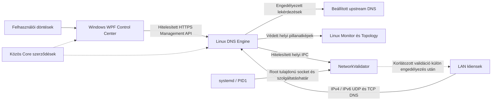

# HostsGuardian

**[English](README.md) | [Magyar](README.hu.md)**

Saját DNS-szűrési, szabálykezelési és diagnosztikai platform a teljes helyi hálózat számára, C#/.NET alapon, Windows WPF Control Centerrel és natív Linux Monitorral.

> **A v0.4.0 fejlesztői kiadás, nem éles használatra kész hálózati készülék.** A HostsGuardian még 1.0 előtti állapotban van. A forráskiadás tartalmazza az elfogadott platformalapokat; a teljes LAN-lefedettség és az aktív validáció továbbra is emberi elfogadást igényel.

**Az Engine végrehajt. A Monitor megfigyel. A WPF-ben a felhasználó dönt.** A felhasználói döntések, a hálózati bizonyítékok és a szabályérvényesítés elkülönülnek. A beállított DNS-útvonal nem bizonyítja a ténylegesen megfigyelt DNS-útvonalat.

## Architektúra



| Összetevő | Feladat |
|---|---|
| `HostsGuardian.Wpf` | Szabályzattervezetek, explicit küldés, felhasználói eszközregisztráció/név/típus és döntések. |
| `HostsGuardian.DnsEngine` | DNS-végrehajtás, szűrés, szabályzatmentés, elemzés és hitelesített felügyelet. |
| HostsGuardian Monitor (`linux-monitor`) | Helyi üzemeltetés, csak olvasható eszközdiagnosztika és bizonyítékalapú topológia. |
| NetworkValidator (`network-validator`) | Elkülönített, szűk jogosultságú hálózati validációs segéd; nem tulajdonosa a szabályzatnak. |
| `HostsGuardian.Core` | Közös szerződések, tartományi szabályok, korreláció és megjelenítési bemenetek. |

**A LAN DNS-forgalma nem halad át a WPF-en.** A kliensek közvetlenül az Engine-t kérdezik. Az önálló Engine-szolgáltatást a systemd kezeli; egyik GUI bezárása sem állítja le a DNS-t. A Monitor életciklusműveletei külön megerősített systemd/polkit-műveletek.

## A forráskiadás képességei

- **Saját dual-stack DNS:** UDP és TCP IPv4-en és IPv6-on, közös szabályértékelés, korlátozott párhuzamosság, véges upstream újrapróbálkozás és explicit fallback.
- **Szabályzat és helyreállítás:** tartós globális/eszközönkénti szabályok, elvárt revízióhoz és Engine-példányhoz kötött küldés, kanonikus visszaolvasás és Emergency Safe Mode. A kapcsolat önmagában nem jelent szinkronizációt; a helyi változások explicit küldésig tervezetek. Sikertelen mentéskor az előző revízió marad érvényben.
- **Regisztrált eszköztár:** változtathatatlan `DeviceId`, felhasználói név/típus és metaadatok megfigyelések hiányában is megmaradnak. Az elfelejtés explicit művelet, nem leválasztás vagy tiltás. A WPF import után egyezteti a regisztrációkat, hogy ne maradjon árva Ismert sor.
- **Magyarázható fingerprinting:** támogatott mDNS/SSDP/hostnév-bizonyítékból típus, bizonyosság és eredet származik. Az elavult megfigyelés nem jelent Online állapotot, és a korlátozott megőrzési időn belül nem törli az utolsó megbízható következtetést. A felhasználó által megerősített típus elsőbbséget élvez; az ellentmondás látható marad.
- **Külön felderítés és lefedettség:** a jelenlét, identitás, DNS-aktivitás, lefedettség és resolver-útvonal külön bizonyítékokra épül. Az ismeretlen/ideiglenes források kiválaszthatók. Egy megfigyelt DNS-kérés az Engine használatát bizonyítja, nem minden kérés kizárólagos lefedettségét.
- **Validált binding-alap:** aktuális, lejáró IP–MAC bizonyíték oldhat fel regisztrált identitást a szabályérvényesítéshez. Az IP nem állandó identitás; elavult, ellentmondó vagy többértelmű adat nem jogosít bindingra. Hiányzó identitásnál globális szabály érvényesül.
- **Windows Control Center:** sötét/zöld felület, élő és tartós EN/HU nyelvváltás, kontextuális tooltip, Policy Preview/Why Blocked, értesítések, audit és szűrés után is legújabb-elöl napló. A natív Windows toast-küldés/navigáció és az ütemezési figyelmeztetés logikája létezik; a valós értesítési/ütemezési elfogadás külön feladat.
- **WPF → Engine → Monitor identitásút:** a regisztráció/metaadat WPF-tervezetbe kerül, teljes szabályzattal explicit elküldhető, az Engine tartósan menti, majd a diagnosztikához korrelálja. A Monitor csak olvassa a nevet; a megfigyelt hostnév elkülönül a felhasználói elnevezéstől.
- **Linux Monitor:** egészség, DNS-aktivitás/eredmények, upstream késleltetés, terhelés, incidensek és tömör eszköz/forrás-diagnosztika; nincs átnevezés, csoport- vagy szabályszerkesztés. A grafikonelőzmény és a publikáció korlátozott.
- **Grafikus Topology:** WHO / PRESENCE / ACCESS / DNS / BINDING / WHY, közös vektorikonok és kiválasztható részletek. A megfigyelt/bizonyított és következtetett kapcsolatok elkülönülnek. Wi-Fi/Ethernet, AP és hozzáférési kapcsolatok infrastruktúra-bizonyíték nélkül **Ismeretlenek**.
- **Telepítési és csomagellenőrzés:** időkorlátos jelölt/visszaállítási readiness megőrzött diagnosztikával, független funkcionális IPv4/IPv6 UDP/TCP-próbák, külön tulajdonos/hitelesítés/megőrzés/segéd ellenőrzések, LF végrehajtható launcherek és közvetlen csomagindítási smoke teszt.

**Megfigyelés ≠ Identitás ≠ Regisztrált eszköztár ≠ Szabályérvényesítési binding.** Offline nem jelent elfelejtett eszközt; a gyorsítótárazott szomszédadat nem bizonyít online jelenlétet. A korreláció routergyártótól független. Későbbi opcionális router/AP adatforrások kiegészíthetik, de nem előfeltételek.

A réteges szabályzatséma és a szolgáltatásdefiníciók/csoportok/profilok/ütemezések szerkesztői determinisztikus forrástesztekkel rendelkeznek. A kiadás **nem állítja** e későbbi roadmap-képességek, a randomizált MAC-összekapcsolás vagy az ideiglenes hozzáférés-hosszabbítás valós LAN-elfogadásának befejezését. [Szabályzatszemantika](docs/roadmap-policy-program.md).

## Biztonság és jogosultságok elkülönítése

A felügyelet **hitelesített HTTPS-t** használ. Windows alatt a hitelesítő adatokat DPAPI védi; a tanúsítványfelvétel explicit és függetlenül ellenőrzött. Nincs csendes bizalomfelvétel vagy HTTP-visszalépés. A hitelesítés a hitelesítő adat birtoklását bizonyítja, nem a végrehajtható állomány identitását.

Az **Engine kizárólag `CAP_NET_BIND_SERVICE`** jogosultságot tart meg. Egyedül a NetworkValidator számára készült **`CAP_NET_RAW`** jogosultságú, korlátozott systemd-szolgáltatás; a Python interpreter nem kap fájlszintű capabilityt. PID1 hozza létre a root tulajdonú Unix listenert védett hierarchiában. A segéd peer credential, rögzített élő Engine MainPID és peer-pidfd életciklus alapján engedélyez; a publikációs útvonalak root-védettek.

Az aktív ARP-validáció **alapértelmezetten KI** van kapcsolva, és emberi valós LAN-elfogadásig így marad. A kérések pontos célra irányulnak, korlátozottak, és hiba esetén nem adnak bindingot; nincs hálózatsöprés vagy általános packet API. A DNS a segéd hiányában is működik, friss validált binding létrehozása nélkül. Az ARP-adat nem kriptográfiai identitás. [Bizalmi határ és korlátok](network-validator/IPC-SECURITY.md).

A szabályzat, hitelesítő adatok, tanúsítványok, privát kulcsok és gépspecifikus telepítési bemenetek nem repository-eszközök. A forrás build/teszt nem engedélyez éles telepítést, szolgáltatásmódosítást vagy hálózati konfigurációt.

## Képernyőképek

A megőrzött **v0.3.0** képek a korábbi elfogadott felületet mutatják, nem az új topológia/eszköznézetet. A WPF-kép regressziós fixture; a Monitor-képek történeti, csak olvasható runtime-felvételek. Nem bizonyítják az aktuális DNS-lefedettséget.


[Képek eredete](docs/assets/v0.3.0/README.md). Friss éles képek a vizuális elfogadás után készülhetnek.

## Ellenőrzés és build

A kiadás ellenőrzései az egyeztetett, autoritatív **v0.4.0** forráson futnak. A pontos eredményeket és indokolt platformkihagyásokat a [kiadási checkpoint](docs/checkpoint-v0.4.0.md) tartalmazza. Az izolált GTK fixture és csomag smoke teszt nem helyettesíti az emberi éles vizuális elfogadást.

```powershell
dotnet build HostsGuardian.sln -t:Rebuild -c Release
dotnet run --project HostsGuardian.RegressionTests -c Release
dotnet run --project HostsGuardian.Wpf.RegressionTests -c Release
python -B development/orchestrator/run-tests.py
```

A `linux-monitor` könyvtárból: `python3 -B -m unittest discover -v`; a `network-validator` és `development/roadmap` könyvtárból ugyanígy. A Linux GTK-tesztekhez PyGObject/GTK4 és grafikus fixture, a Topologyhoz `python3-cairo` és `python3-gi-cairo` kell. A Windows WPF .NET 8-at és Windowst igényel. A Monitor-csomag builder közvetlenül indítja a kicsomagolt launchert `--smoke-check` módban, ablak és szolgáltatásvezérlés nélkül.

A Development Orchestrator külön fejlesztői eszköz, nem a termék runtime-szolgáltatása. Hordozható példakonfigurációját helyileg másolni és beállítani kell. [Eszközleírás](development/orchestrator/README.md).

## Korlátok és roadmap

- **1.0 előtti állapot:** a teljes LAN/router-DHCP és alternatív resolver-útvonal lefedettsége nem teljes. A DHCP-beállítás önmagában nem bizonyít lefedettséget.
- **Aktív validáció:** a telepítési alap elfogadott; az aktív ARP kikapcsolva marad. Engedélyezése előtt emberi elfogadás kell.
- **Identitás:** a randomizált MAC-folytonosság nem automatikus; nincs IP/név-alapú összevonás. Az ismeretlen/ideiglenes eszközök teljes értékűek. Az IPv6 DNS működik, de IPv6 aktív eszközbinding nincs igazolva.
- **Szabályérvényesítés:** a teljes eszközönkénti lefedettség friss validált bindingtól és a tényleges DNS-útvonaltól függ. A gyorsítótárazott alkalmazásmunkamenet nem feltétlenül ér véget azonnal DNS-szabályváltáskor.
- **Topológia:** a hozzáférési technológia/AP/SSID/port és kizárólagos DNS-lefedettség bizonyíték nélkül Ismeretlen; opcionális infrastruktúra-integráció későbbi munka.
- **Elfogadás:** természetes forgalom/incidensek, tényleges eszközszűrés, natív toast/ütemezési UX és a Monitor-csomagjavítás éles vizuális elfogadása még tartalmaz függő tételeket.
- **Roadmap:** először kontrollált valós LAN identitás/binding/biztonsági elfogadás; utána szolgáltatáskatalógus/csoportok/ütemezések és értesítések validálása. Ideiglenes hosszabbítás és felhasználói randomizált-MAC összekapcsolás későbbi feladat.
- A korábbi systemd `NeedDaemonReload` kérdést kivizsgáltuk és az elfogadott telepítéshez tisztáztuk. E forráskiadás nem végez reloadot vagy runtime-módosítást.

A történeti [v0.3.0 checkpoint](docs/checkpoint-v0.3.0.md) és az aktuális [identitás/binding/topológia-terv](docs/device-identity-validation-program.md) elkülöníti a megvalósítást, fixture-ellenőrzést és emberi elfogadást.
