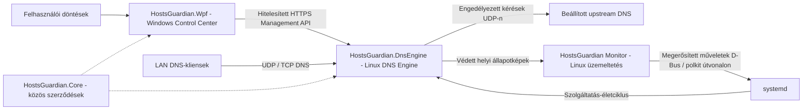

# HostsGuardian

**[English](README.md) | [Magyar](README.hu.md)**

Saját fejlesztésű DNS-szűrőrendszer C#/.NET alapon, Windows WPF szabályzatkezelő Control Centerrel és natív Linux felügyeleti Monitorral.

> **A v0.3.0 elfogadott fejlesztési checkpoint, nem éles használatra kész kiadás.** A HostsGuardian még 1.0 előtti projekt. Az elfogadás a dokumentált Windows- és Linux-munkafolyamatokra terjed ki; a teljes LAN és további valós eszközök vizsgálata még függőben van. Termék-checkpoint verzió: **0.3.0**; Git-tag: **v0.3.0**.

A HostsGuardian különválasztja a felhasználói döntéseket, a DNS-végrehajtást és az üzemállapot bizonyítékait. A hangsúly a szabályzat kifejezett elküldésén, a valós állapotjelzésen, a korlátozott diagnosztikán és a szűrési szabályokat észrevétlenül nem módosító helyreállításon van.

## Architektúra



| Összetevő | Feladat |
|---|---|
| `HostsGuardian.Wpf` | Windows Control Center: helyi szabályzattervezetek, kifejezett felhasználói döntések, biztonságos kezelés és állapotmegjelenítés. |
| `HostsGuardian.DnsEngine` | Saját Linux DNS-szűrő és végrehajtó Engine: kérések, globális/eszközszabályzat, tartós tárolás, elemzés és Management API. |
| HostsGuardian Monitor (`linux-monitor`) | Helyi Linux-üzemeltetés, diagnosztika és megfigyelhetőség. Az Engine bizonyítékait jeleníti meg; szabályzatot nem szerkeszt. |
| `HostsGuardian.Core` | Közös szerződések, szabályzat- és tartománylogika, valamint kezelési kliensszolgáltatások, ahol alkalmazható. |

**A LAN DNS-forgalma nem halad át a WPF-en.** A GUI hitelesített HTTPS-en kommunikál az Engine-nel; a DNS-kliensek közvetlenül az Engine-t érik el. Az önálló Engine-szolgáltatást a systemd kezeli. Egyik GUI bezárása sem állítja le a DNS-t; a Monitor Start/Stop/Restart műveletei külön, kifejezett műveletek.

## Elfogadott képességek

- **Saját UDP/TCP DNS:** közös kérésfeldolgozás, korlátozott párhuzamosság, keretezett TCP-kérések, véges upstream újrapróbálkozás és kifejezetten beállított tartalék upstream. Nem szükséges más gyártó szűrőmotorja. Az engedélyezett kéréseket továbbítja; a globális és eszközdöntéseket az Engine értékeli ki.
- **Globális és eszközönkénti szabályzat:** globális domainszabályok és `Inherit` / `Allow` / `Block` felülbírálások, szülő-/aldomainhatárokkal. Az eszközönkénti kiértékelést izolált regressziós tesztek fedik le; a valós, regisztrált eszközökkel végzett elfogadás még függőben van.
- **Stabil azonosítás:** a tartós, változatlan `DeviceId` elkülönül az IP-címtől és a felderítési metaadatoktól. A változatlan szabályzat-/hozzárendelési állapotképek ellenőrzött, lejáró IP-megfigyeléseket használnak. Ismeretlen/elavult/kétértelmű azonosságnál a globális szabályzat érvényesül; a felderítés önmagában nem engedélyez hozzárendelést.
- **Kifejezett elküldés/visszaolvasás:** a helyi módosítások tervezetek maradnak. A teljes csere ellenőrzi a várt verziót és Engine-példányt. A szinkronizáláshoz nyugtázás, kanonikus szabályzat-visszaolvasás és egyező hitelesített állapot szükséges; a kapcsolat önmagában nem elegendő.
- **Safe Mode és helyreállítás:** a megerősített futásidejű megkerülés megőrzi a mentett szabályokat és verziót. A kilépéshez érvényes szabályzat és visszaolvasás szükséges. Újraindításkor a mentett szabályzat áll helyre; sérült/elérhetetlen szabályzatnál védelmi megkerülés lép életbe, nem keletkeznek kitalált szabályok. A Safe Mode nem javítja meg az elérhetetlen upstreamet vagy a hibás gépet.
- **Tartós tárolás:** mentés a siker nyugtázása előtt; sikertelen íráskor megmarad a korábbi verzió. A feldolgozás és leállítás korlátozott, a szolgáltatás életciklusa független a GUI-étól.
- **Windows UX:** sötét/zöld Control Center, hat külön, lejáró üzemállapot, élő és megőrzött EN/HU nyelvváltás, lokalizált kontextuális súgók, eszközszabályzat-megjelenítés és naplószintszűrés. A szokásos Windows HOSTS-szűrés vezérlői megszűntek; a régi bejegyzések takarítása külön, kifejezett migrációs segédművelet.
- **Értesítések/audit:** lokalizált alkalmazáson belüli értesítések, olvasatlan/kritikus állapot, ismétlések összevonása/helyreállítás és strukturált helyi auditesemények. A korábbi nyers üzenetek és OS-kivételek megőrzik eredeti nyelvüket. A natív Windows toast aktiválása halasztott feladat.
- **Egységes Linux Monitor:** Overview, Diagnostics, Events / Incidents és Details egy GTK4 alkalmazásban. A Start/Stop/Restart megerősítést, meglévő systemd D-Bus/polkit jogosultságellenőrzést és tényleges szolgáltatás/PID visszaolvasást igényel.
- **Diagnostics V1/üzemeltetési események:** korlátozott számlálók, késleltetési/erőforrás-/terhelési bizonyítékok, memóriabeli grafikonok és strukturált Warning/Critical/Recovery incidensek. Az Engine végzi az elemzést; a Monitor védett helyi állapotképeket jelenít meg. Hiányzó/elavult bizonyíték esetén az állapot Ismeretlen. A szabályzat szerinti blokkolás sikeres szűrésnek számít.

Elfogadott Monitor forrás-/csomagazonosító: **`0.3.0+unified1`**. A megtartott, Windowson elfogadott WPF a meglévő értesítési modelljét használja; a jelölt automatikus üzemeltetésiesemény-lekérdezése nincs integrálva ebbe a checkpointba.

## Biztonság és telepítés

A Management API **HTTPS-t és bearer-hitelesítést** igényel. A Windows DPAPI-val tárolja a hitelesítő adatokat. A tanúsítvány felvétele kifejezett művelet, független ujjlenyomat-ellenőrzéssel; a kapcsolatok ellenőrzik a felvett tanúsítványazonosságot, a kiszolgálóazonosságot, az érvényességet és a szerverhitelesítési felhasználást. Nincs észrevétlen tanúsítványfelvétel vagy HTTP-re visszalépés. A hitelesítés a hitelesítő adat birtoklását igazolja, nem a futtatható program azonosságát.

Az Engine külön Linux systemd szolgáltatás; az asztali alkalmazások szokásos működésükhöz nem igényelnek rendszergazdai/root jogosultságot. A Monitor megbízható helyi bizonyítékot olvas, és csak a rögzített szolgáltatásegység műveleteit kéri a meglévő interaktív jogosultságellenőrzésen keresztül. Csomagja nem telepít új systemd unitot/drop-int vagy polkit jogosultságot. A hitelesítő adatok, tanúsítványok, privát kulcsok, éles szabályzat és gépspecifikus beállítások telepítési bemenetek, nem repository-fájlok. A LAN DNS-útvonalát külön kell megtervezni és elfogadni.

## Képernyőképek

**Windows Control Center, magyarul:** az elfogadott elrendezés megőrzött regressziós tesztrenderelése. Az Ismeretlen állapotok tesztadatok, nem élő éles kapcsolatot mutatnak.


**Telepített Unified Monitor, Overview:** megőrzött, csak olvasási ellenőrző felvétel, letiltott vezérlőkkel. A listening állapot nem bizonyítja a teljes DNS-útvonalat. A képen szereplő assembly-verzió korábbi futásidejű metaadat, nem a javasolt termékverzió.


**Telepített Unified Monitor, Diagnostics:** a felvételen nem volt megfigyelt természetes DNS-forgalom vagy sikeres upstream késleltetési minta; az üres grafikonok nem kitalált aktivitást jelentenek.


[Képernyőképek eredete és hashértékei](docs/assets/v0.3.0/README.md)

## Ellenőrzés és állapot

Az elfogadott Vivo-forrás integrálása után, **2026. október 5-én** ellenőrzött eredmények:

| Ellenőrzés | Eredmény | Lefedettség |
|---|---|---|
| Core/Engine | **202 regressziós csoport PASS** | DNS/szabályzat/biztonság/tárolás, diagnosztika, incidensek és integrált viselkedés izolált tesztkörnyezetben. |
| WPF | **11 regressziós csoport PASS** | Tényleges kötések, EN/HU váltás, értesítések, elrendezés és elutasított mentés visszagörgetése. |
| Monitor Windowson | **31 PASS; 11 GTK/platformteszt kihagyva** | 42 felismert teszt. A kihagyás nem hiba és nem végrehajtott Linux GUI-teszt. |
| Solution újrafordítása | **0 hiba** | A meglévő függőségi/platformfigyelmeztetések megmaradtak. |
| Vivo Unified Monitor futás/telepítés | **PASS a dokumentált lefedettségen belül** | Telepített `0.3.0+unified1`; valódi GUI Stop/Start/Restart megerősítés + polkit/systemd útvonalon, friss bizonyíték és önálló Engine. |
| Windows WPF futási/emberi elfogadás | **PASS a dokumentált lefedettségen belül** | Nem rendszergazdai indítás, elrendezés, nyelv megőrzése, hitelesített Engine-kapcsolat, valós állapotlejárat, Safe Mode, tervezetek és önálló bezárás/újranyitás. |
| Forrásintegráció | **PASS** | A Monitor/Core/Engine manifest-hashek és a megőrzött Debian csomagtartalom egyezik; a Windowson elfogadott WPF-forrás megmaradt. |

A Debian csomagot Windowson nem fordítottuk újra. A forrás/csomagtartalom azonossága ellenőrzött; eltérő eszközláncok között bájtra azonos binárisokat nem állítunk. A hatókört és a függő lefedettséget a [v0.3.0 checkpoint-jegyzőkönyv](docs/checkpoint-v0.3.0.md) tartalmazza.

### Fordítás és regressziós ellenőrzések

A Windows projektek .NET 8-at céloznak; a WPF Windowst igényel. A Monitor Python 3-at, GTK4/PyGObjectet és systemd D-Bust használ. Ezek a parancsok forrást fordítanak/tesztelnek, telepítés vagy üzembe helyezés nélkül:

```powershell
dotnet build HostsGuardian.sln
dotnet run --project HostsGuardian.RegressionTests
dotnet run --project HostsGuardian.Wpf.RegressionTests
```

A Monitor teszteket a saját könyvtárából kell futtatni:

```text
cd linux-monitor
python -m unittest discover -v
```

A GTK-tesztekhez megfelelő Linux grafikus környezet szükséges. Az eredmények nem engedélyeznek éles szolgáltatás-/hálózati módosítást. A Linux csomag a `debian/rules` és a Monitor-indító futtathatóságát igényli.

## Jelenlegi korlátok

- **1.0 előtti állapot:** ez a fejlesztési checkpoint nem éles használatra kész hálózati készülék.
- **A Phase 5E-8 továbbra is szünetel:** a teljes LAN/router-DHCP elfogadás függőben van; nem minden kliens DNS-útvonala igazolt.
- **A természetes DNS-/incidenslefedettség hiányos:** a természetes kérések/incidensek nélküli időablak nem bizonyítja azok kézbesítését. Ezek lezárásához nem hoztunk létre mesterséges éles incidenseket.
- **A valós, regisztrált eszközökkel végzett elfogadás függőben van.** Az ellenőrzött IPv4-hozzárendelés a támogatott azonosítási modell; IPv6-eszközszűrést és NAT/router DNS-proxy miatt elveszett azonosság kezelését nem állítjuk.
- **A `NeedDaemonReload=yes` ismert, vizsgálat alatt álló telepítési körülmény.** Az elfogadás megőrizte; itt nem jelent reloadot/systemd-módosítást.
- **A natív Windows toast aktiválása továbbra is halasztott.** Az alkalmazáson belüli értesítések elérhetők; a korábbi nyers/OS-üzenetek angolul maradhatnak.
- A diagnosztikai előzmény korlátozott/memóriabeli. Természetes upstream-megfigyelés hiányában az állapot Ismeretlen, nem megerősített siker. A grafikus bejelentkezés autostart-beállítását kijelentkezési/újraindítási elfogadás nélkül vizsgáltuk.

## Ütemterv — ez a checkpoint nem valósítja meg

1. A WPF Napló legújabb bejegyzései kerüljenek előre, a szintszűrés után is.
2. Bővebb valóseszköz-, természetesforgalom-/incidens-, akadálymentességi és asztali automatizálási lefedettség.
3. A systemd reload-körülmény vizsgálata és a halasztott toast aktiválás befejezése kifejezett felülvizsgálattal.
4. A Phase 5E-8 teljes LAN/router-DHCP elfogadás folytatása csak külön engedélyezés után.

## További dokumentáció

- [Unified Monitor architektúra](docs/linux-monitor-unified.md)
- [Diagnostics V1 szerződések és metrikák](docs/linux-diagnostics-console-v1.md)
- [WPF lokalizáció/értesítési alapok](docs/wpf-ux-localization-notifications.md)
- [POST-5E-7 forrásarchitektúra](docs/post5e7-integrated-milestone.md)
- [Valós eszközök végponttól végpontig tartó tesztterve](docs/real-device-e2e-plan.md)

A korábbi tervezési/forráskapu-jegyzetek megőrzik történeti környezetüket. A jelenlegi elfogadott hatókört a [v0.3.0 checkpoint-jegyzőkönyv](docs/checkpoint-v0.3.0.md) írja le.
