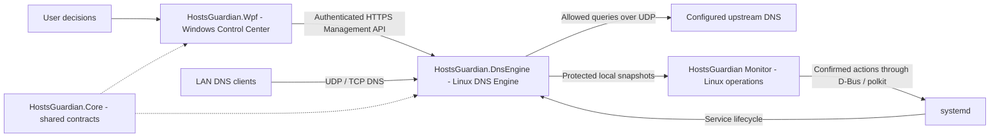
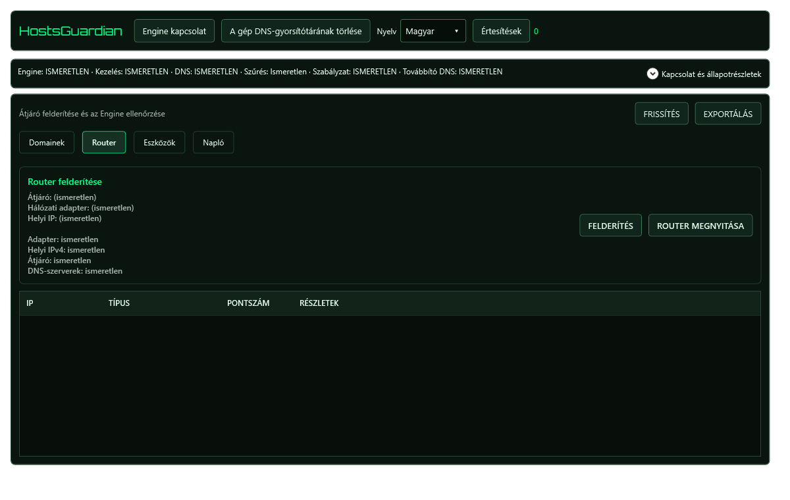
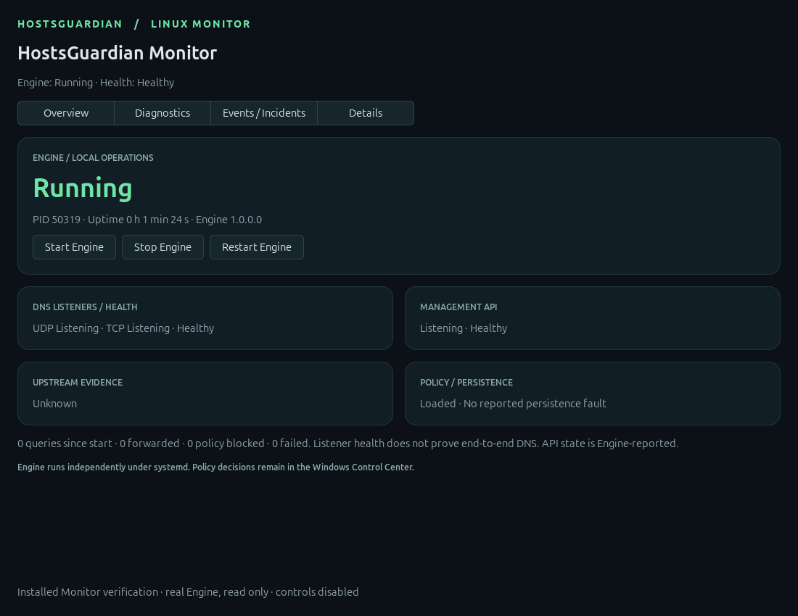
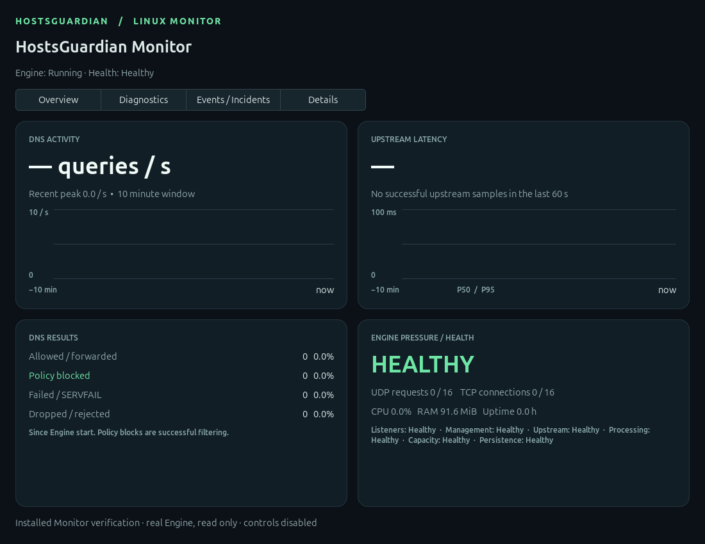

# HostsGuardian

**[English](README.md) | [Magyar](README.hu.md)**

A custom DNS filtering system built with C#/.NET, a Windows WPF policy Control Center, and a native Linux operations Monitor.

> **v0.3.0 is an accepted development checkpoint, not a production-ready release.** HostsGuardian is pre-1.0. Acceptance covers the documented Windows and Linux workflows; whole-LAN and additional real-device coverage remain pending. Product checkpoint version: **0.3.0**; Git tag: **v0.3.0**.

HostsGuardian separates user decisions, DNS execution, and operational evidence. Its focus is explicit policy delivery, truthful status, bounded diagnostics, and recovery without silently changing filtering rules.

## Architecture



| Component | Responsibility |
|---|---|
| `HostsGuardian.Wpf` | Windows Control Center: policy drafts, explicit user decisions, secure management, and status presentation. |
| `HostsGuardian.DnsEngine` | Custom Linux DNS filtering/execution Engine: requests, global/device policy, persistence, analysis, and the Management API. |
| HostsGuardian Monitor (`linux-monitor`) | Local Linux operations, diagnostics, and observability. It displays Engine evidence and does not edit policy. |
| `HostsGuardian.Core` | Shared contracts, policy/domain logic, and management client services where applicable. |

**LAN DNS traffic does not pass through WPF.** The GUI talks to the Engine over authenticated HTTPS; DNS clients talk directly to the Engine. systemd owns the independent Engine service. Closing either GUI does not stop DNS; Monitor Start/Stop/Restart are separate explicit operations.

## Accepted capabilities

- **Custom UDP/TCP DNS:** shared request processing, bounded concurrency, framed TCP queries, finite upstream retries, and explicitly configured fallback. No third-party filtering engine is required. Allowed queries are forwarded; global and device decisions are evaluated by the Engine.
- **Global and per-device policy:** global domain rules plus `Inherit` / `Allow` / `Block` overrides, with parent/subdomain boundaries. Device evaluation has isolated regression coverage; populated real-device acceptance remains pending.
- **Stable identity:** durable immutable `DeviceId` values are separate from IP addresses and discovery metadata. Immutable policy/binding snapshots use validated, expiring IP observations. Unknown/stale/ambiguous identity uses global policy; discovery alone does not authorize a binding.
- **Explicit delivery/readback:** local edits remain drafts. Full replacement checks expected revision and Engine instance. Synchronization requires acknowledgement, canonical policy readback, and matching authenticated status; connectivity alone is insufficient.
- **Safe Mode and recovery:** confirmed runtime bypass preserves committed rules and revision. Exit requires valid policy and readback. Restart restores committed policy; corrupt/unavailable policy enters protective bypass instead of inventing rules. Safe Mode cannot repair an unreachable upstream or failed host.
- **Persistence:** updates persist before acknowledgement; failed writes retain the prior revision. Processing and shutdown are bounded, and service lifetime is independent of GUI lifetime.
- **Windows UX:** dark/green Control Center, six separate expiring operational states, persistent live EN/HU switching, localized contextual tooltips, device-policy presentation, and severity filters. Ordinary Windows HOSTS filtering controls are retired; legacy cleanup is a separate explicit migration helper.
- **Notifications/audit:** localized in-app notifications, unread/critical state, deduplication/recovery, and structured local audit events. Historical raw messages and OS exceptions retain their source language. Native Windows toast activation is deferred.
- **Unified Linux Monitor:** Overview, Diagnostics, Events / Incidents, and Details in one GTK4 application. Start/Stop/Restart require confirmation, existing systemd D-Bus/polkit authorization, and actual service/PID readback.
- **Diagnostics V1/operational events:** bounded counters, latency/resource/pressure evidence, in-memory graphs, and structured Warning/Critical/Recovery incidents. The Engine produces analysis; Monitor presents protected local snapshots. Missing/stale evidence remains Unknown. Policy blocks count as successful filtering.

Accepted Monitor source/package identity: **`0.3.0+unified1`**. The retained Windows-accepted WPF uses its existing notification model; candidate automatic operational-event polling is not integrated into this checkpoint.

## Security and deployment

The Management API requires **HTTPS and bearer authentication**. Windows saves credentials using DPAPI. Certificate enrollment is explicit, with independent fingerprint verification; connections validate enrolled identity, host identity, validity, and server-auth usage. There is no silent enrollment or HTTP downgrade. Authentication proves credential possession, not executable identity.

The Engine is a separate Linux systemd service; desktop applications run without routine administrator/root privileges. Monitor reads trusted local evidence and requests only fixed-unit actions through existing interactive authorization. Its package installs no new systemd unit/drop-in or polkit privilege grant. Credentials, certificates, private keys, production policy, and machine-specific configuration are deployment inputs, not repository assets. LAN DNS routing requires separate planning and acceptance.

## Screenshots

**Windows Control Center, Hungarian:** preserved regression-fixture render of the accepted layout. Unknown states are fixture data, not a live production connection.



**Installed Unified Monitor, Overview:** preserved read-only verification capture with controls disabled. Listening does not prove end-to-end DNS. The captured assembly version is historical runtime metadata, not the proposed product version.



**Installed Unified Monitor, Diagnostics:** no natural DNS traffic or successful upstream latency samples were observed in this capture; empty graphs do not invent activity.



[Screenshot provenance and hashes](docs/assets/v0.3.0/README.md)

## Verification and status

Verified on **2026-10-05**, after accepted Vivo-source reconciliation:

| Check | Result | Coverage |
|---|---|---|
| Core/Engine | **202 regression groups PASS** | DNS/policy/security/persistence, diagnostics, incidents, and integrated behavior in isolated fixtures. |
| WPF | **11 regression groups PASS** | Actual bindings, EN/HU switching, notifications, layout, and rejected-save rollback. |
| Monitor on Windows | **31 PASS; 11 GTK/platform tests skipped** | 42 tests discovered. Skips are neither failures nor executed Linux GUI tests. |
| Solution rebuild | **0 errors** | Existing dependency/platform warnings remain. |
| Vivo Unified Monitor runtime/deployment | **PASS within documented coverage** | Installed `0.3.0+unified1`; real GUI Stop/Start/Restart through confirmation + polkit/systemd, fresh evidence, and Engine independence. |
| Windows WPF runtime/human acceptance | **PASS within documented coverage** | Non-administrator launch, layout, language persistence, authenticated Engine access, truthful expiry, Safe Mode, drafts, and close/reopen independence. |
| Source reconciliation | **PASS** | Monitor/Core/Engine manifest hashes and preserved Debian package payload match; accepted Windows WPF source retained. |

The Debian package was not rebuilt on Windows. Source/payload identity is verified; bit-identical binaries across toolchains are not claimed. See the [v0.3.0 checkpoint record](docs/checkpoint-v0.3.0.md) for scope and pending coverage.

### Build and regression checks

The Windows projects target .NET 8; WPF requires Windows. Monitor uses Python 3, GTK4/PyGObject, and systemd D-Bus. These commands build/test source without installing or deploying it:

```powershell
dotnet build HostsGuardian.sln
dotnet run --project HostsGuardian.RegressionTests
dotnet run --project HostsGuardian.Wpf.RegressionTests
```

Run the Monitor suite from its own directory:

```text
cd linux-monitor
python -m unittest discover -v
```

GTK tests require the appropriate Linux graphical environment. Results do not authorize production service/network changes. Linux packaging requires executable `debian/rules` and Monitor launcher files.

## Current limitations

- **Pre-1.0:** this development checkpoint is not a production-ready network appliance.
- **Phase 5E-8 remains paused:** whole-LAN/router-DHCP acceptance is pending; not every client's DNS routing is proven.
- **Natural DNS/incident coverage is incomplete:** windows without natural queries/incidents do not prove delivery coverage. No synthetic production incidents were generated to close these gaps.
- **Populated per-device real-device acceptance is pending.** Validated IPv4 bindings are the supported identity model; IPv6 device enforcement and identity lost through NAT/router DNS proxies are not claimed.
- **`NeedDaemonReload=yes` is a known deployment caveat under investigation.** It was preserved during acceptance; no reload/systemd change is implied here.
- **Native Windows toast activation remains deferred.** In-app notifications are available; historical raw/OS messages may remain English.
- Diagnostics history is bounded/in-memory. No natural upstream observation means Unknown, not confirmed success. Graphical-login autostart configuration was inspected without logout/reboot acceptance.

## Roadmap — not implemented by this checkpoint

1. Newest-first WPF Log ordering, preserved after severity filtering.
2. Broader populated-device, natural-traffic/incident, accessibility, and desktop automation coverage.
3. Investigate the systemd reload caveat and complete deferred toast activation with explicit review.
4. Resume Phase 5E-8 whole-LAN/router-DHCP acceptance only when separately authorized.

## Further reading

- [Unified Monitor architecture](docs/linux-monitor-unified.md)
- [Diagnostics V1 contracts and metrics](docs/linux-diagnostics-console-v1.md)
- [WPF localization/notification foundation](docs/wpf-ux-localization-notifications.md)
- [POST-5E-7 source architecture](docs/post5e7-integrated-milestone.md)
- [Real-device end-to-end plan](docs/real-device-e2e-plan.md)

Earlier design/source-gate notes retain their historical context. The [v0.3.0 checkpoint record](docs/checkpoint-v0.3.0.md) describes the current accepted scope.
