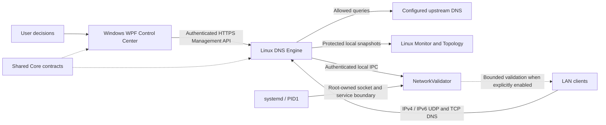

# HostsGuardian

**[English](README.md) | [Magyar](README.hu.md)**

A custom whole-LAN DNS filtering, policy and diagnostics platform built with C#/.NET, a Windows WPF Control Center and a native Linux Monitor.

> **v0.4.0 is a development release, not a production-ready network appliance.** HostsGuardian is pre-1.0. The source checkpoint includes accepted platform foundations; complete LAN coverage and active validation still require human acceptance.

**Engine executes. Monitor observes. WPF decides.** User decisions, network evidence and enforcement are deliberately separate. Configured DNS paths are not proof of observed DNS paths.

## Architecture



| Component | Responsibility |
|---|---|
| `HostsGuardian.Wpf` | Policy drafts, explicit delivery, user-owned device registration/name/type and decisions. |
| `HostsGuardian.DnsEngine` | DNS execution, filtering, policy persistence, analysis and authenticated management. |
| HostsGuardian Monitor (`linux-monitor`) | Local operations, read-only device diagnostics and evidence-driven topology. |
| NetworkValidator (`network-validator`) | Dedicated, narrowly privileged network-validation helper; no policy ownership. |
| `HostsGuardian.Core` | Shared contracts, domain rules, correlation and presentation inputs. |

**LAN DNS traffic does not pass through WPF.** Clients contact the Engine directly. systemd owns the independent Engine service; closing either GUI does not stop DNS. Monitor lifecycle controls are separate confirmed operations through systemd/polkit.

## Capabilities in this source checkpoint

- **Custom dual-stack DNS:** UDP and TCP over IPv4 and IPv6, shared policy evaluation, bounded concurrency, finite upstream retries and explicitly configured fallback.
- **Policy and recovery:** persisted global/per-device policy, expected-revision/instance delivery, canonical readback and Emergency Safe Mode. Connectivity alone does not mean synchronization; local changes stay drafts until explicitly sent. Failed persistence retains the previous committed revision.
- **Registered inventory:** immutable `DeviceId`, user-owned friendly name/type and metadata survive absent observations. Forget is explicit and does not disconnect or ban a device. WPF reconciles imported registrations to prevent orphaned Known rows.
- **Explainable fingerprinting:** supported mDNS/SSDP/hostname evidence produces a type with confidence and provenance. Stale observation does not imply Online or erase the last reliable inference within its bounded retention. User-confirmed type wins; ambiguous evidence remains visible.
- **Separate discovery and coverage:** presence, identity, DNS activity, coverage and resolver path have separate evidence. Unknown/provisional sources are selectable. An observed DNS query proves activity through the Engine, not exclusive coverage of every device request.
- **Validated binding foundation:** current expiring IP-to-MAC evidence can resolve a registered identity for enforcement. IP is not permanent identity; stale, conflicting or ambiguous evidence does not authorize a binding. Missing identity uses global policy.
- **Windows Control Center:** dark/green UI, live persistent EN/HU localization, contextual tooltips, policy preview/Why Blocked, notifications, audit and newest-first filtered logs. Native Windows toast transport/navigation and schedule-warning logic exist; real notification/schedule acceptance remains separate.
- **WPF → Engine → Monitor identity flow:** registrations and metadata are saved in the WPF draft, explicitly delivered with complete policy, committed by the Engine and correlated into diagnostics. Monitor consumes friendly identity read-only; observed hostname remains separate from user naming.
- **Linux Monitor:** health, DNS activity/results, upstream latency, pressure, incidents and compact device/source diagnostics; no rename, group or policy controls. Graph history and publication are bounded.
- **Graphical Topology:** WHO / PRESENCE / ACCESS / DNS / BINDING / WHY, shared vector icons and selectable details. Observed/proven and inferred links are distinguished. Wi-Fi/Ethernet, AP or access relationships remain **Unknown** without infrastructure evidence.
- **Deployment and packaging checks:** bounded candidate/rollback readiness with retained diagnostics, independent functional IPv4/IPv6 UDP/TCP probes, separate ownership/authentication/preservation/helper checks, LF executable launchers and direct package launch smoke verification.

**Observation ≠ Identity ≠ Registered Inventory ≠ Enforcement Binding.** Offline does not mean forgotten; cached neighbours do not prove online presence. Correlation is router-vendor-independent. Optional future router/AP evidence providers may enrich it, but are not prerequisites.

Layered policy schema/editors for service definitions, groups, profiles and schedules have deterministic source coverage. This release does **not** claim completed real-LAN acceptance for those later roadmap capabilities, randomized-MAC linking, or temporary access extensions. [Policy semantics](docs/roadmap-policy-program.md).

## Security and privilege separation

Management uses **authenticated HTTPS**. Windows protects credentials with DPAPI; certificate enrollment is explicit and independently verified. There is no silent trust enrollment or HTTP downgrade. Authentication proves credential possession, not executable identity.

The **Engine retains only `CAP_NET_BIND_SERVICE`**. NetworkValidator alone is designed to receive **`CAP_NET_RAW`**, through its constrained systemd service, never a capability grant on the Python interpreter. PID1 creates the root-owned Unix listener in a protected hierarchy. Helper authorization uses peer credentials, the fixed live Engine MainPID and peer-pidfd lifetime checks; publication paths are root-protected.

Active ARP validation is **OFF by default** and remains disabled pending human real-LAN acceptance. Requests are exact-target, bounded and fail closed; there is no sweep/general packet API. DNS continues if the helper is unavailable, without creating a fresh validated binding. ARP evidence is not cryptographic identity. [Trust boundary and limitations](network-validator/IPC-SECURITY.md).

Policy, credentials, certificates, private keys and machine-specific deployment inputs are not repository assets. Source builds/tests do not authorize production installation, service changes or network configuration.

## Screenshots

These preserved **v0.3.0** captures illustrate the earlier accepted UI, not the new topology/device presentation. The WPF image is a regression fixture; Monitor images are historical read-only runtime captures. They do not prove current DNS coverage.


[Screenshot provenance](docs/assets/v0.3.0/README.md). Updated production screenshots are deferred until visual acceptance.

## Verification and build

Release checks run against the reconciled authoritative **v0.4.0** source. Exact results and justified platform skips are recorded in the [release checkpoint](docs/checkpoint-v0.4.0.md). Isolated GTK fixtures and package smoke tests do not replace human production visual acceptance.

```powershell
dotnet build HostsGuardian.sln -t:Rebuild -c Release
dotnet run --project HostsGuardian.RegressionTests -c Release
dotnet run --project HostsGuardian.Wpf.RegressionTests -c Release
python -B development/orchestrator/run-tests.py
```

From `linux-monitor`, run `python3 -B -m unittest discover -v`; from `network-validator` and `development/roadmap`, run the same command. Linux GTK tests need PyGObject/GTK4 and a graphical fixture; Topology needs `python3-cairo` and `python3-gi-cairo`. Windows WPF requires .NET 8 and Windows. The Monitor package builder directly executes the extracted launcher with `--smoke-check`, without opening a window or controlling services.

Development Orchestrator is separate tooling, not a product runtime service. Its portable configuration example must be copied and configured locally. [Tooling guide](development/orchestrator/README.md).

## Limits and roadmap

- **Pre-1.0:** whole-LAN/router-DHCP and alternate resolver-path coverage remain incomplete. DHCP configuration alone does not prove coverage.
- **Active validation:** deployment foundation is accepted; active ARP remains disabled. Human acceptance is required before enabling it.
- **Identity:** randomized-MAC continuity is not automatically inferred; no IP/name-only merge. Unknown/provisional devices remain first-class. IPv6 DNS works, but IPv6 active per-device binding is not claimed.
- **Enforcement:** complete per-device coverage depends on fresh validated network bindings and the actual DNS path. Cached application sessions need not end immediately on a DNS policy change.
- **Topology:** access technology/AP/SSID/port and exclusive DNS coverage remain Unknown without supporting evidence; optional infrastructure integrations are future work.
- **Acceptance:** natural traffic/incident coverage, populated-device enforcement, native toast/schedule UX and the Monitor-only packaging repair's production visual acceptance still have pending items.
- **Roadmap:** complete controlled real-LAN identity/binding/security acceptance first; then validate service catalog/groups/schedules and notification behavior. Temporary extensions and user-directed randomized-MAC linking remain deferred.
- The earlier systemd `NeedDaemonReload` caveat was investigated and cleared for the accepted deployment. This source release performs no reload or runtime changes.

Historical [v0.3.0 checkpoint](docs/checkpoint-v0.3.0.md) and current [identity/binding/topology design](docs/device-identity-validation-program.md) retain the distinction between implementation, fixture verification and human acceptance.
